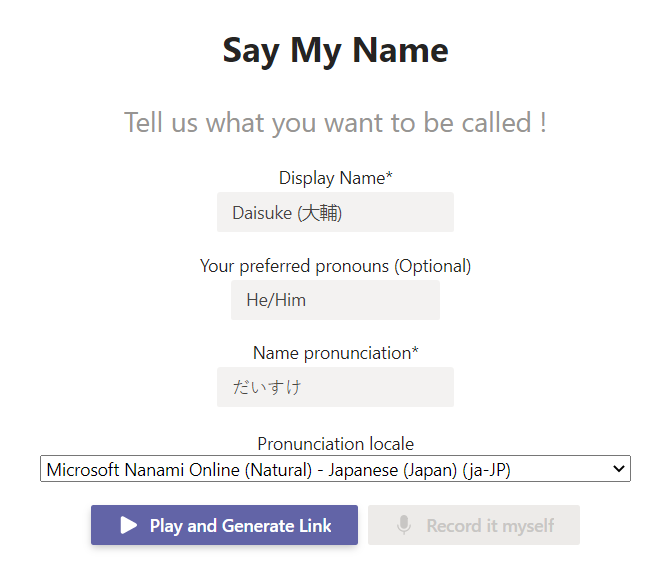
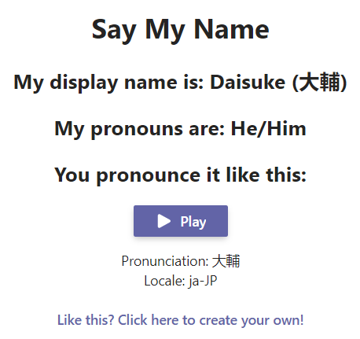

# Say my name

## Examples
 - [Daisuke (Japanese)](https://howtosaymy.name/?display=Daisuke%20(%E5%A4%A7%E8%BC%94)&locale=ja-JP&native=%E5%A4%A7%E8%BC%94&pronoun=He/Him)
 - [Xiaolu (Mandarin)](https://howtosaymy.name/?display=Xiaolu&locale=zh-CN&native=%E5%B0%8F%E9%B9%BF&pronoun=She/Her)
 - [Bujuanes](https://howtosaymy.name/?display=Bujuanes&locale=tr-TR&native=Bujuanes&pronoun=She/Her)
 - [Vaughan](https://howtosaymy.name/?display=Vaughan&locale=en-US&native=Vaughan&pronoun=He/Him)

## Documentation

- [Personas](documentation/personas.md)
- [UX mockups](documentation/ux-mockups.md)
- [Technology Decisions](documentation/technology-decisions.md)
- [Roadmap](documentation/roadmap.md)
- [Teams development setup](teams/README.md)

## Repository structure
- **Web:** public website accessible at <https://HowToSayMy.Name>
- **Teams:** the Teams Tab application

## Screenshots

