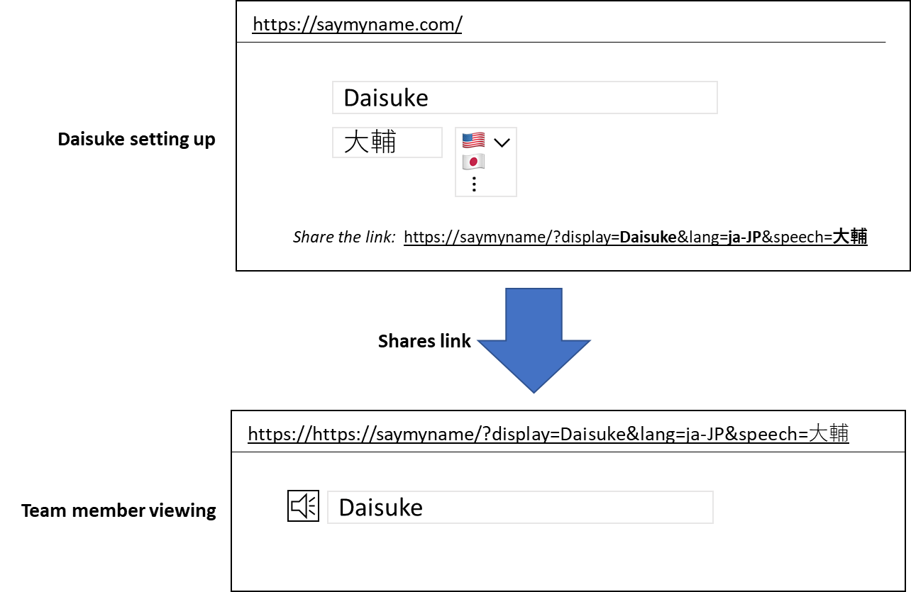
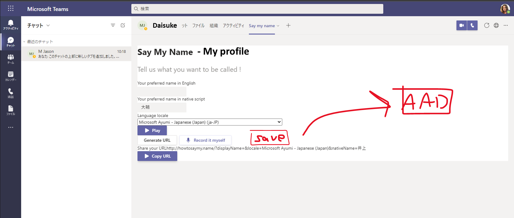
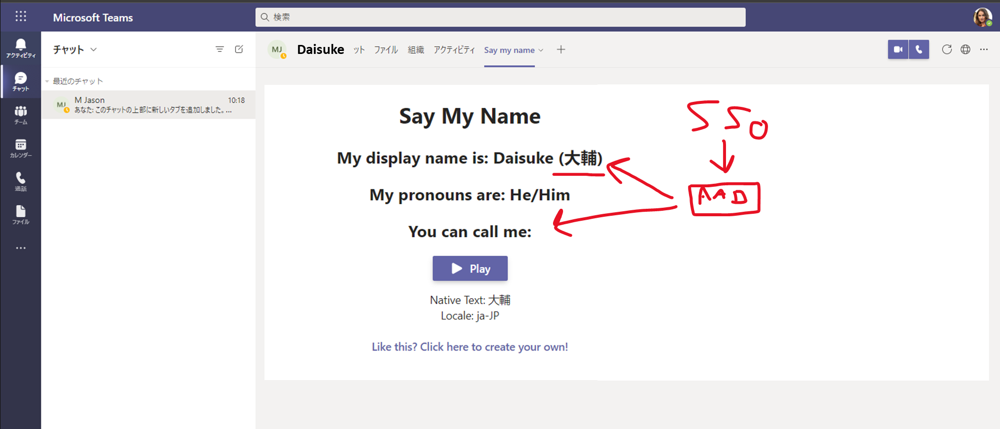

# UX Mockups
See [Personas](personas.md) for more details on expected scenarios. UX mockups are representative of the flows, and are not meant to be 1:1 for the final UI layout.

## Web experience
- Persona 1
  - Goes to the public website
  - Inputs their details
  - Generates a URL to share
- Persona 2
  - Clicks on the shared link
  - Can view details, and play the TTS pronunciation

## Teams
- Persona 1
  - Goes to the public website
  - Inputs their details
  - Clicks save to push their details via Microsoft Graph, into their AAD profile

- Persona 2
  - Opens Persona 1's profile
  - Navigates to the `Say my name` tab
  - Microsoft Graph query retrieves the defined properties
  - Can view details, and play the TTS pronunciation
